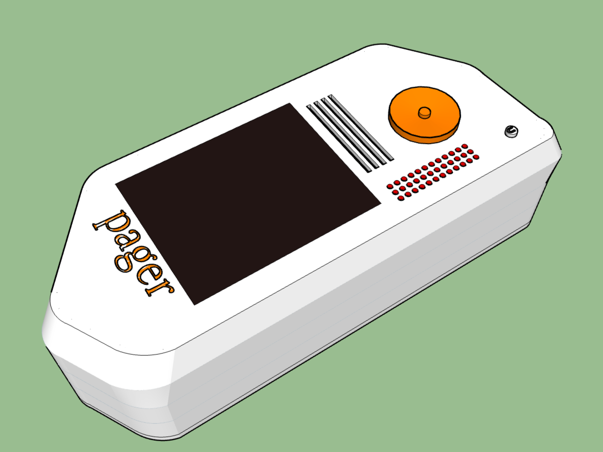

# pager
pager is a modern handheld communication device  

### why
I wanted to build an all in one handheld communication device, I built a very early prototype (kanata-05/infrared) with infrared morse code communication (see below)  

It worked out! but the range was only 3-4 inches at best  
So I'm now making pager, quite a HUGE leap.  

# Hardware

### 2.4" TFT LCD
This is the display, I chose a TFT LCD as these are cheap

### Raspberry Pi Zero 2 W
This is the computer, it's a powerful computer for it's size, I couldn't use something like a RPI4 or 5 since they're too big (and expensive lol) It'll be going under alot of work, since the LoRA messaging system uses end-to-end encryption (ChaCha20-Poly1305) and the fact that there's a browser on here (Midori)

### NEO-6M
This is the GPS module, it's quite cheap and works well, I wanted the pager to double as a survival tool in some cases, so I added this on and oh look, you can use the pager as a map, send people your location and what not!

### EBYTE E220-900T22D 
This is the LoRA module, I chose this over something like RFM98 or SX1278 as it's got an SMA connector built right into it, I am still looking for cheaper options as this is still kinda expensive, 868 mhz is unlicensed and allows for higher power transmission which is more range!

### Antenna
It's... an antenna wow extremely mindblowing

### LM2596S Regulator
This is the regulator for powering all the components, I use 2 of these in each unit, One is dedicated to the SIM800L module since it does 2A spikes, and one powers the RPI Zero 2 W, the LoRA Module and GPS Module and the TFT LCD, This comes just under 2A total, which is the typical rated current, though it can go to 3A MAX for a very short time

### Lithium Ion Battery 
These are 18650 Lithium Cells, 3.7v 5000mAh, I used 2 of these. Nothing much else.

### MPU6050 and QMC5883L
This is a pair of an accelerometer and a 3-axis compass, for navigating and other cool things.

### INA219
This is a battery gauge, for measuring the battery's fuel, I was orignally not adding this, since I was using a TP4056 for charging (which acts as a battery gauge as well) but turns out it doesn't work for a 2S battery.

### SIM800L
This is the SIM Module, It uses 2G/GSM network which has been completely phased out in places like the USA but in India, 2G is still active, I wasn't able to get something like 4G/5G as the modules are simply too expensive (and big).

You can use any Airtel/VI sim since they have a 2G network, and If you use, say a Airtel 5G sim card, Airtel will simply fall you back to a 2G network (since the SIM800L can only talk on 2G).  
Now do note this only works for carriers that still support 2G network fallback (Airtel, VI..), but for example, Jio only supports 4G/5G networks so your sim simply won't register on their networks.

2G is still active, but may be phased out around 2027/28, It's been kept active because running costs are quite low (efficient)

With a SIM card, you can call and message
Without a SIM card, you should still be able to call emergency services

### Capacitors
For smoothening and all that

### 2S 8.4v 4A Charger
This is the charging module, it's probably some TP5100 or something, It uses type-C.

### IRLML2502
This is a N-Channel MOSFET, it's for controlling the display's brightness with PWM

### PAM8302
2.5W Speaker Amplifer for a 4 ohm speaker

### Speaker
Speaker speaks

### 8 ohm speaker
The amplifer is built for a 4 ohm speaker so why not use a 8 ohm one right?

### INMP441
MEMS Microphone

### M274-360
Rotary Encoder to control the speaker volume

### Cooling Fan
Cooling Fan very cool
